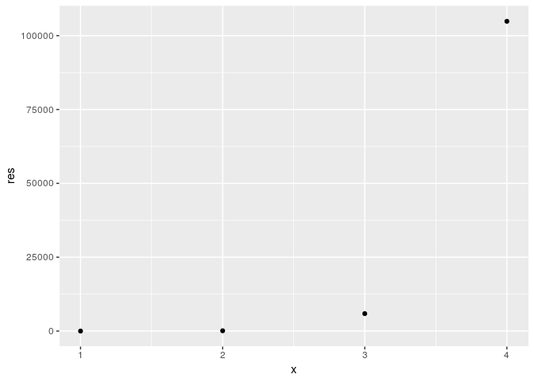

<!-- README.md is generated from README.Rmd. Please edit that file -->
[](https://travis-ci.org/vincenzocoia/powers)

**Note**: This R package is not mean to be "serious". It's just for ~~teaching~~ **learning** purposes.

References
----------

This package is based off of Vincenzo's package [powers](https://github.com/vincenzocoia/powers)

powers
------

This is an R package that gives `sqrt()` friends by providing other power functions.

boxcox
------

This package also allows the easy use of the [box-cox transform](https://en.wikipedia.org/wiki/Power_transform#Box%E2%80%93Cox_transformation).

Installation
------------

You can install powers from github with:

``` r
# install.packages("devtools")
devtools::install_github("vincenzocoia/powers")
```

Example
-------

See the vignette for more extensive use, but here's an example:

``` r
powers::reciprocal(2)
#> [1] 0.5
```

And here's an example of the box-cox function:

``` r
powers::boxcox(c(1,2,3,4),lambda=10,plot=TRUE)
```



    #> [1]      0.0    102.3   5904.8 104857.5

For Developers
--------------

Use the internal `pow` function as the machinery for the front-end functions such as `square`, `cube`, and `reciprocal`.
